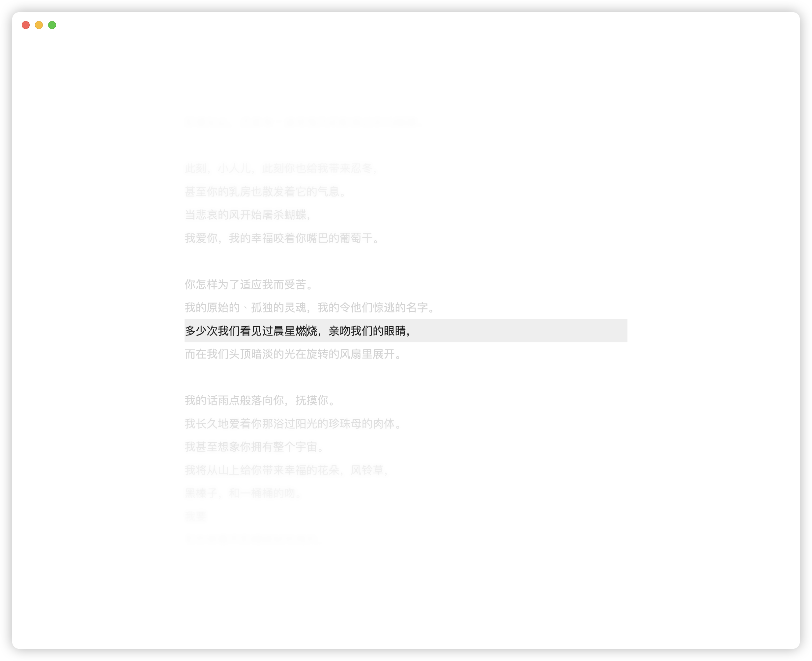
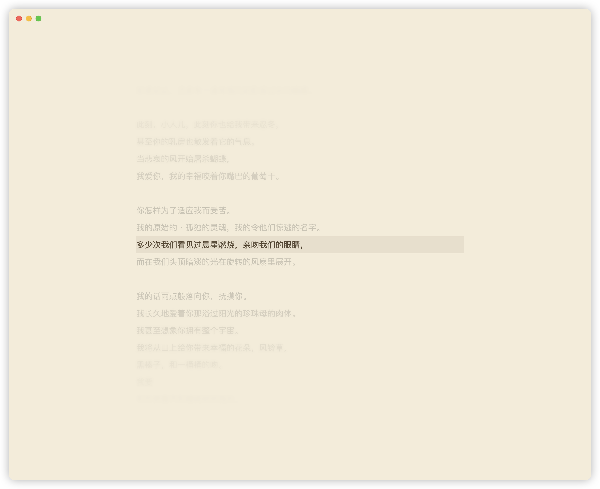
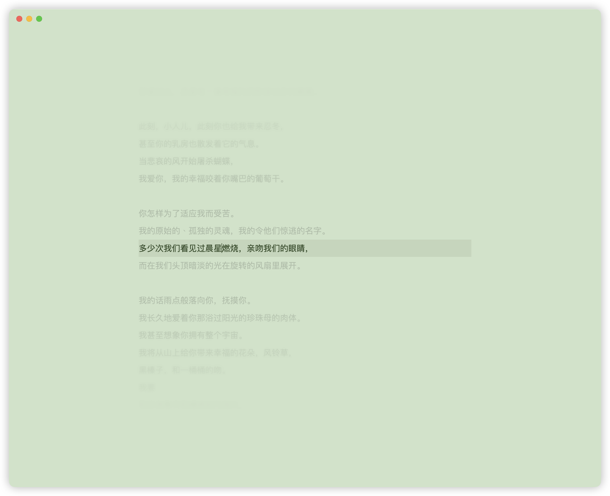
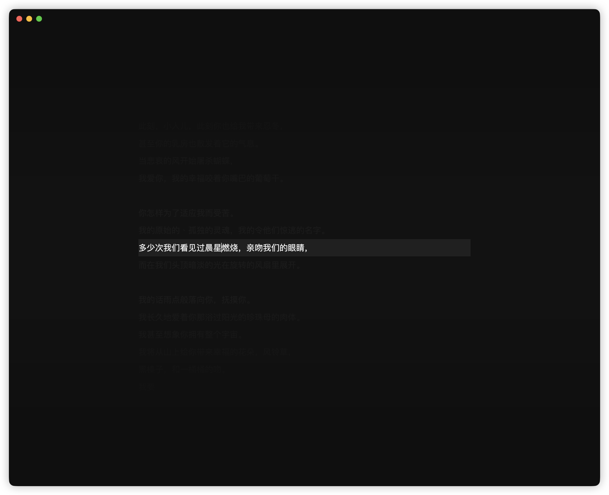

# Zen Writer

English | [简体中文](./README_CN.md)

A premium, distraction-free immersive writing environment for Obsidian.

## ✨ Features

- **Typewriter Scrolling**: Keeps your active line centered vertically, reducing neck strain during long writing sessions.
- **Immersive Paper Themes**:
    - **System Default**: Seamlessly blends with your current Obsidian theme.
      
    - **Sepia**: Warm, paper-like tones for an analog feel.
      
    - **Green**: Refreshing mint colors to reduce eye fatigue.
      
    - **Dark Night**: High-contrast deep gray mode for maximum focus.
      
- **Ultra-Minimal UI**: Automatically hides sidebars, ribbons, and status bars, leaving you with nothing but a pure writing canvas.
- **Focus Guidance**: Uses a unique "Picker" mask and subtle background dimming to naturally lock your eyes onto the current paragraph.
- **Ambient Sound**: Optional background soundscapes (rain, campfire, ocean waves, morning birds, and more) streamed from the Internet Archive to help you reach a flow state. Scenes are looped seamlessly with smooth 2-second fade-in/out.
- **Full Localization**: Native support for English and Chinese (i18n), ensuring all settings and commands feel right at home.

> **Network usage**: When the Ambient Sound feature is enabled, the plugin streams audio files from [archive.org](https://archive.org) (Internet Archive), a US non-profit open-access library. Requests are made only when you explicitly enable this feature and enter Zen mode. No personal data is transmitted; only audio file HTTP requests are sent.


## 🚀 Quick Start

### Commands
- Run **"Enter/Exit Zen Writing Mode"** from the Command Palette.
- Press **`Esc`** at any time to quickly exit.

### Settings
Customize your experience:
- Choose your **Paper Theme**.
- Adjust the **Content Max Width**.
- Fine-tune **Dim Opacity** for non-active lines.
- Toggle the minimal **Top Exit Button**.

## 📦 Installation

1. Search for **Zen Writer** in the Obsidian Community Plugins (Coming Soon).
2. **Manual Installation**:
    - Download `main.js`, `styles.css`, and `manifest.json` from the [Releases](https://github.com/T1Si/obsidian-zen-writer/releases) page.
    - Place them into `.obsidian/plugins/obsidian-zen-writer/`.
    - Reload Obsidian and enable the plugin.

## 🛠 Development

```bash
npm install
npm run dev   # Hot-reload development
npm run build # Build for production
```

## 📄 License

MIT License.
